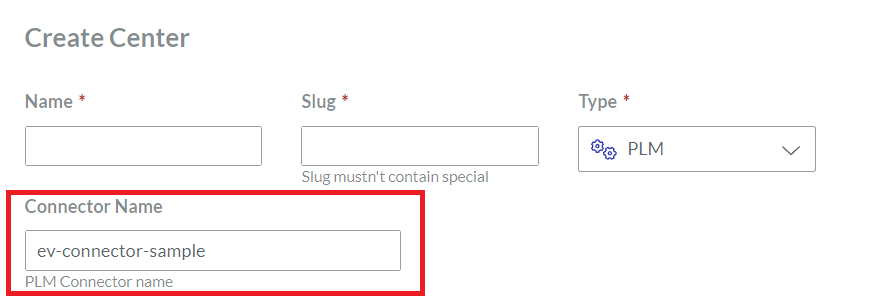

# Ev-Connector Sample for Envision

## About

This package is an example of implementation of a "envision connector", for Envision product. 

## Prerequisites

Before starting to build the "envision connector", these tools need to be installed:

- Node JS LTS (https://nodejs.org/en/download)

## Instructions

To create your own connector for a specific PLM system, please follow these steps:

1 - clone this project

2 - implement the different functions available in plm-connector-example.ts (this file can be renamed, as well as the class name)

3 - Build the file, by running 
```
npm install && npm build
```

4 - Copy the built file from `dist/plm-connector-example.js` to the installation path of Envision `<Envision installation path>/dist/workspaces/server/`

5 - Sign in to Envision as a Workspace admin, Go to admin section, and configure PLM Center according to the screenshot below:



## Note

You'll find this sample on github: https://github.com/canvasgfx/plm-connector-sample

