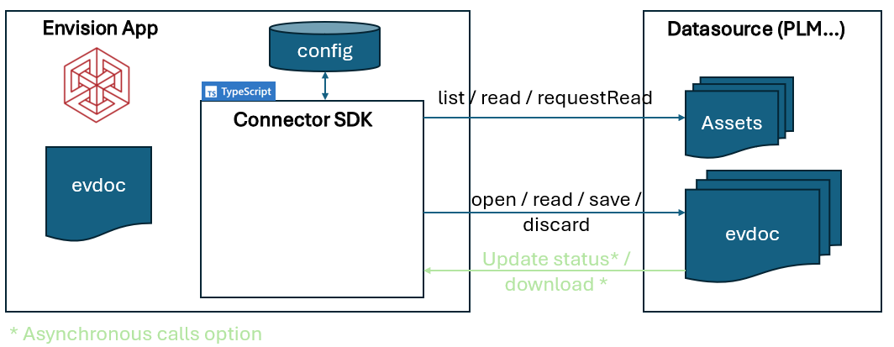
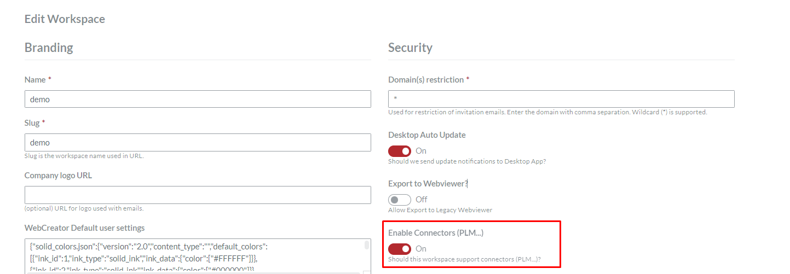
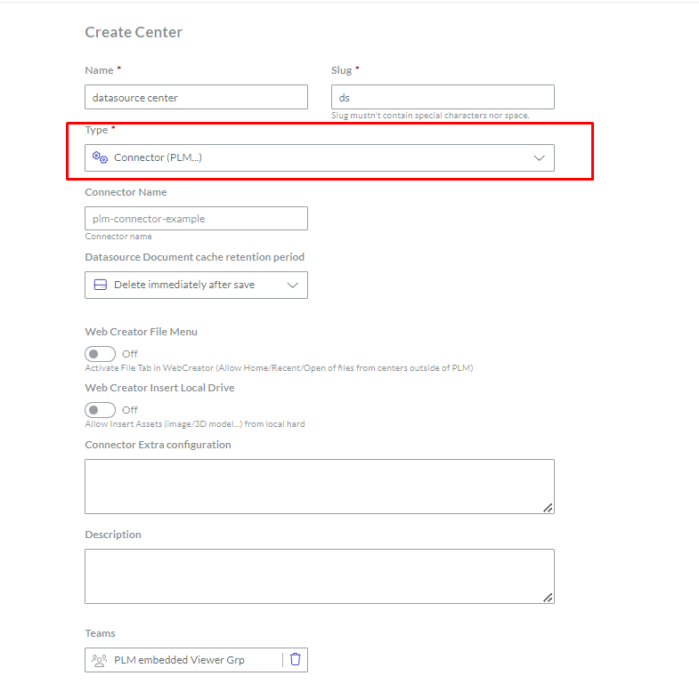
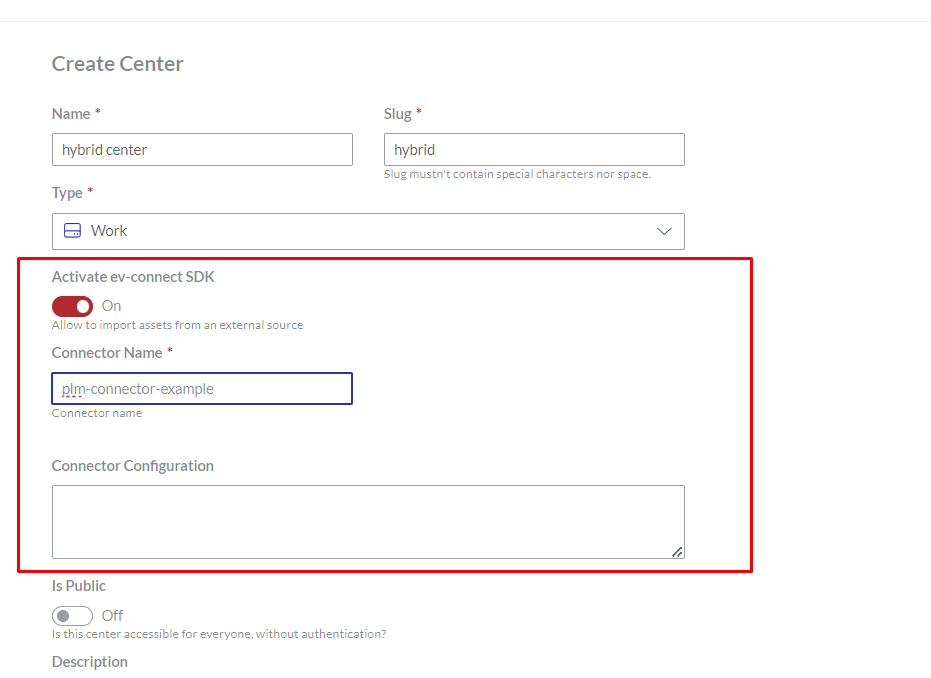
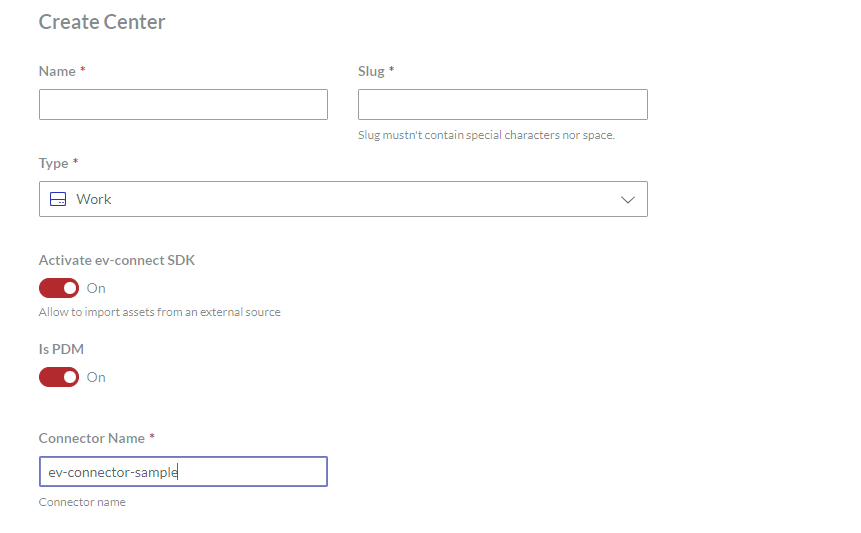
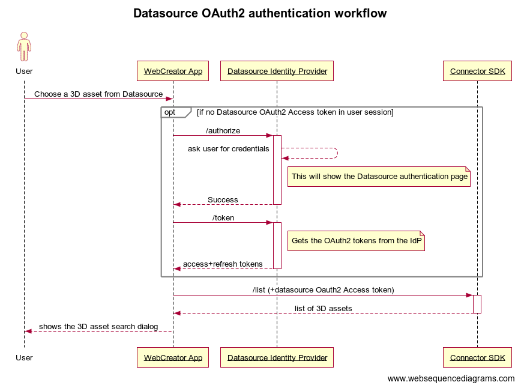

# Getting started with Envision Connector SDK

## Table of contents


1. [About](#About)
2. [Glossary](#Glossary)
3. [Architecture](#Architecture)
4. [Connector installation](#connector-installation)
5. [Connector configuration](#connector-configuration)
6. [Writing a Connector step by step](#writing-a-connector-step-by-step)
 * [connector context](#connector-context)
 * [discard function](#discard-function)
 * [list function](#list-function)
 * [open function](#open-function)
 * [readWithMeta function](#readwithmeta-function)
 * [requestRead function](#requestread-function)
 * [save function](#save-function)
 * [save and Done function](#save-and-done-function)
7. [Authentication with Datasource](#authentication-with-datasource)
8. [Read/write workflows](#readwrite-workflows)
9. [General error handling in Connector](#general-error-handling-in-connector)
10. [Envision API endpoints](#envision-api-endpoints)

## About 

This article describes how to write an Envision Connector, in Typescript.
Envision Connector lets you connect a datasource system (like a PLM) to Envision Product. 


For example:
- You can integrate a PLM software to import all the assets (3D, images, CAD information) in Envision Creator,
- You can load an Envision document (evdoc) that is stored in the PLM software and also save it in Envision.
- You can save an Envision document back to the PLM software/Datasource.

In order to create these functionalities, you'll need to create a Connector between the datasource system and Envision.

This connector needs to be written in Typescript (or Javascript), and installed on Envision server.
Then, you'll need to configure Envision to use the Connector (see configuration below).

## Glossary

### evdoc
This is the format of Envision document that is used to save/load document in Envision Creator.
The extension name is `.evdoc`

### Envision Creator
Also called Envision App. This is the product used to create/edit/view Envision documents

### Envision Connector SDK
Also called ev-connect SDK. This is the element (written in Typescript/Javascript) that is used by Envision Creator to communicate with datasource system.
It is installed on Envision server and uses specific configuration to connect to the datasource.

### Datasource system
This is the application that will be connected to Envision Creator, and that stores all the assets/documents. It's the "single source of truth"

## Architecture

### Diagram


The architecture is composed of 2 main elements: Envision Creator application, and the Datasource software (PLM...).

The 2 elements communicate with each other thanks to the Connector SDK, that is installed on Envision server and written in Typescript/Javascript.

The connector uses a [configuration](#connector-configuration) that is set by a workspace administrator in Envision UI. This configuration specifies Datasource URL, and other parameters.

Each time an action that is triggered by the user in the UI that requires interaction with Datasource, the Connector SDK is called.

## Connector installation

To install a connector on Envision server, follow these steps:

1 - clone this project

2 - implement the [different functions](#writing-a-connector-step-by-step) available in ev-connector-example.ts (this file can be renamed, as well as the class name)

3 - Build the file, by running
```
npm install && npm build
```

4 - Copy the built file from `dist/ev-connector-example.js` to the installation path of Envision `<Envision installation path>/dist/apps/server/`


## Connector configuration

In order for the connector to work properly, it needs a few settings in Envision Application.

1. The workspace needs to be configured to enable connector SDK (in the Envision Internal section)



2a. If we want the datasource to store/load evdocs, we need to create a Connector Center in Workspace Admin section as shown below:
   

Some extra parameters are available:
* **Connector Name**: The connector name installed on Envision server (it is the javascript file name, see [connector installation](#connector-installation))
* **Datasource Document retention period**: if you want to keep a cache of the evdoc on Envision side (to speed up the load process), you can specify a retention period here. If you don't want to keep a copy of the evdoc in Envision server, select "Delete immediately after save".
* **Web Creator File Menu**: To show the File/Recent/Open file menu in Envision WebCreator
* **Web Creator Insert Local Drive**: To allow the user to select assets from the local drive or not

> NOTE : if you use the Embedded WebViewer in the datasource, please make sure `PLM embedded Viewer Grp` is selected in the Teams list

2b. If we only want the datasource for assets import (images/3D...), `and the evdoc is only stored in Envision Server` we can use a regular Center and enable the functionality as shown below:


2c. If we want the evdocs in the datasource and Envision to be synchronized, create a regular Center, and enable the Activate **ev-connect SDK** and **isPDM** toggles as shown below:



3. To configure the connector, you need to provide a configuration object. This configuration will be passed to the Connector SDK when it runs. The configuration is a JSON object that typically includes details such as the URL to the data source and other relevant settings.

You can also define any additional properties in this JSON object that you might need later in your connector functions. This JSON object will be passed as a parameter to all connector functions. Here is an example:

> {"datasource_url":"1.2.3.4/mydatasource","database":"InnovatorSolutions","grant_type":"authorization_code","client_id":"InnovatorClient","scope":"openid offline_access Innovator", "show_file_open":true,"search_params":[{"id":"name","label":"Name"},{"id":"id","label":"PLM ID"},{"id":"item_number","label":"PLM Number"},{"id":"workpace_id","label":"PLM Workspace ID"}], "pdm_auth_type": "password", "pdm_auth_name": "Vault", "query_limit": 50}


3a. In the above example, the following are some of the optional configurations. 

   (i) **"show_file_open":** This boolean property is set to true if you need a command to open a file from Canvas' side navigation menu or ribbon menu.
   
   (ii) **"search_params":** This is an array of objects where each object contains id, label, and placeholder properties. These objects can be used for advanced search queries.

   (iii) **"pdm_auth_type":** This property should be set to "password" if an additional authentication layer is required. When enabled, after the primary authentication, a dialog box will prompt the user to enter credentials for the second authentication layer. These credentials are passed to the connector via the context.connector_username and context.connector_password properties. The connector is responsible for handling this secondary authentication using the provided credential values.
         **pdm_auth_name:** If you want to display a custom name (e.g., the name of the company or authentication layer) in the dialog box described in the previous point, you can assign that value to this property. The specified name will appear in the secondary authentication dialog for user clarity.

   (iv) **query_limit:** This property sets the maximum number of records that can be returned by the connector's list function. You can assign any numerical value to define the limit of records retrieved in a single query.


## Writing a Connector step by step

### Connector example

You'll find the connector example here: [https://github.com/canvasgfx/ev-connector-sample/src/ev-connector-example.ts](https://github.com/canvasgfx/ev-connector-sample/blob/main/src/ev-connector-example.ts)
This is a good starting point, as it provides the minimum basic functions to be implemented.

In order for the connector to communicate with third-party application, it needs a few functions to be implemented. These functions are described below.

#### Connector context

For each function described below, a context object is passed as parameter. This object contains all the information needed to connect to datasource.
You can see a description of the context object here: [ev-connector-helper.types.ts](../src/ev-connector-helper.types.ts)

#### discard function

This function is called when user hits "Discard" button in the User Interface:


This command discards the local changes in Envision WebCreator, and notifies datasource system of this action
(this will typically release the datasource document lock, on datasource side)

*Function signature*

`discard(context: EvConnectorContextDto, datasourceObj: EvConnectorObjectDefinition): Promise<void>;`

*Parameters*

`context` context of the call (user id, center id...)`

`datasourceObj` datasource document

#### list function

This function is called when user hits "Image", "3D Model" or "Queried table" button in the User Interface:


This command will list all the assets in the datasource system, based on the query

*Function signature*

`list(context: EvConnectorContextDto, query: EvConnectorQuery): Promise<Array<EvConnectorObjectDefinition>>;`

*Parameters*

`context` context of the call (user id, center id...)`

`query` connector query, @see: EvConnectorQuery

#### open function

This function is called when user opens a document from datasource system.
The datasource system will use a specific Envision Creator URL to open the document, for example:

https://envision_creator_install.com/design/?id=XXXX&center_id=2&revision=A&plm_file_id=YYYY&name=TestDocument

It notifies datasource system that the document has opened successfully in WebCreator
(it typically will lock the document in datasource system)


*Function signature*

`open(context: EvConnectorContextDto, id: string, revision: string, name: string, is_new?: boolean): Promise<void>;`

*Parameters*

`context` context of the call (user id, center id...)

`id` connector document identifier

`revision` connector document revision number

`name` connector document name. This field is important when we first create the document in Envision

`is_new` is it a new connector document? If yes, we recommend to create an empty file on datasource system to avoid any problem in
other workflows.

#### readWithMeta function

This method is used to grab the data from datasource system.

It reads datasource asset (binary) with metadata (last update date...).

The data could be an evdoc, 3D asset, image, or Queried table.

NOTE: this method is used when Envision Creator needs to load the evdoc (if user tries to open it).

*Function signature*

`readWithMeta(context: EvConnectorContextDto, datasourceObj: EvConnectorObjectDefinition): Promise<[Readable, EvConnectorObjectMetaData]>;`


*Parameters*

`context` context of the call (user id, center id...)

`datasourceObj` the datasource object info to get the file content

#### requestRead function

This command notifies datasource that the PLM document/asset will be downloaded.
When it's ready to be downloaded, PLM system needs to notify it with PlmObjectStatus.DOWNLOAD_READY

*Function signature*

`requestRead(context: EvConnectorContextDto, datasourceObj: EvConnectorObjectDefinition): Promise<boolean>;`

*Parameters*

`context` context of the call (user id, center id...)

`datasourceObj` the datasource object info to get the file content


#### save function

This command is triggered whenever the user hits "save" button in the User Interface


It can notify datasource system that the document is ready to be saved
(the document on WebCreator will be in PENDING_SAVE status until the operation is finished on datasource side)

It can also directly send the data to the datasource (depending on the datasource workflow, see section Synchronous calls below).

*Function signature*

`save(context: EvConnectorContextDto, datasourceObj: EvConnectorObjectDefinition, content?: Readable, assets?: Array<EvConnectorAsset>): Promise<boolean>;`


*Parameters*

`context` context of the call (user id, center id...)

`content` the content to save in datasource (if async call, this field is not used. See doc).

`assets` the list of assets attached to this document

`datasourceObj` the datasource object info to get the file content

#### save and Done function

This command is triggered whenever the user hits "Done" button in the User Interface


This command is similar to `save` except that it can perform extra steps on datasource side (for example, releasing a lock)

*Function signature*

`saveAndDone(context: EvConnectorContextDto, datasourceObj: EvConnectorObjectDefinition, content?: Readable, assets?: Array<EvConnectorAsset>): Promise<boolean>;`


*Parameters*

`context` context of the call (user id, center id...)

`content` the content to save in datasource (if async call, this field is not used. See doc).

`assets` the list of assets attached to this document

`datasourceObj` the datasource object info to get the file content

## Authentication with Datasource

### Introduction (basic authentication)
In order for Envision Connector to communicate with datasource system, it needs a mechanism to authenticate to it.

Some extra parameters can be configured in the user interface, as shown below:


If there is any need for specific URL, info, or secret, it could be specified here.

Please note that this information is not encrypted, so every Envision Workspace administrator can see the values.

Then, in the connector code, you can access such information using `EvConnectorContextDto.connector_config`. (It will contain all the information of this field).

### OAuth2 authentication

#### Authorization Code flow
For a more robust and secure way to authenticate on Datasource side, Envision uses OAuth2 workflow. 

> In order for this mode to be activated, [the Connector SDK configuration](#connector-configuration) needs to have `grant_type` sets to `authorization_code` and `server_url` sets to the URL of the Identity Provider (where .well-known/openid-configuration is).

Each time an action is initiated by the user that needs the connector SDK, Envision makes sure that a Datasource OAuth2 Access token is available and up to date on client side.
If not, it automatically starts an OAuth2 authentication workflow, redirecting the user to the Datasource Identity Provider, as shown in the diagram below:


**Note:** In the connector configuration, you can set the "is_redirect_uri_configured" property to true if the redirect URI is handled and configured by the authenticator itself.

#### Password flow
This solution is less secure than Authorization Code. However, if Authorization code is not possible, Connector SDK can use a password Oauth2 flow.
> In order for this mode to be activated, [the Connector SDK configuration](#connector-configuration) needs to have `grant_type` sets to `password` and `server_url` sets to the URL of the Identity Provider (where .well-known/openid-configuration is).

In this mode a popup will show up, asking the user to enter their credentials (username and password). When the form is submitted, it will send the data to the Identity Provider, to get Oauth2 tokens.
## Read/write workflows

Connector can support 2 different ways to get/save the data in the datasource. Asynchronous or synchronous workflow.

### Synchronous workflow

When the datasource is capable of dealing with Read/write sync calls, here are the steps to implement this workflow:

*Sync Read calls*
1. Envision Creator will notify datasource that it's starting to read data (via Connector), if needed. When `requestRead` is implemented, it must return `false` at the end of the function, to tell the application that the call is synchronous.
2. Envision Creator will download content from datasource right after step 1 (without waiting). It will call `readWithMeta` to get data content from datasource.

*Sync Write calls*
1. Envision Creator will upload content that it wants to save into datasource (via Connector). When `save` or `saveAndDone` is implemented, just send data content with the correct endpoint to upload into datasource.


### Asynchronous workflow

Sometimes the datasource is used asynchronously for saving/loading data. It could be the case if datasource needs extra work to prepare data to be downloaded or saved.

*Async Read calls*

The steps are:
1. Envision Creator will notify datasource that it wants to read data (via Connector). When `requestRead` is implemented, just call datasource with the correct endpoint to notify it. Method must return `true`.
2. When data is ready to be downloaded, datasource must notify Envision. It can do it with API endpoint here: [Update datasource Object status](https://github.com/canvasgfx/ev-connector-sample/blob/main/docs/GETTING_STARTED.md#update-datasource-object-status) with the status **DOWNLOAD_READY**
3. Then, `readWithMeta` will be automatically called to download data from datasource

*Async Write calls*

The steps are:
1. Envision Creator will notify datasource that it wants to save data (via Connector). When `save` or `saveAndDone` is implemented, just call datasource with the correct endpoint to notify it. Method must return `true`.
2. Datasource then will call API endpoint here: [Read Object content](https://github.com/canvasgfx/ev-connector-sample/blob/main/docs/GETTING_STARTED.md#read-object-content)
3. Then, when everything is correctly saved on datasource side, it must notify Envision that the operation is complete, using [Update datasource Object status](https://github.com/canvasgfx/ev-connector-sample/blob/main/docs/GETTING_STARTED.md#update-datasource-object-status) with the status: **SAVE** or **SAVE_DONE**. 

*Error handling in Async*

If at any time, an error occured on datasource side, it can notify Envision by calling [Update datasource Object status](https://github.com/canvasgfx/ev-connector-sample/blob/main/docs/GETTING_STARTED.md#update-datasource-object-status) with the status: **ERROR**, and the `reason` (which will be displayed to the end user)

## General error handling in Connector

If an error occurred, connector implementation should throw:

`new BadRequestException('message to display to end user');`

or

`new UnprocessableEntityException('token expired');` (in case a datasource Access Token needs to be renewed on client side)

You can also log into the server logs, using:

- `context.logger.log('message')` 
- `context.logger.warn('message')`
- `context.logger.error('message')`

## Envision API endpoints

There is a few API endpoints that can be used by datasource to communicate with Envision.

### Update datasource Object status

This endpoint is used to notify that something happened on datasource side (async workflow).


### Read Object content

This endpoint is used to download an evdoc that is stored in Envision Creator.

