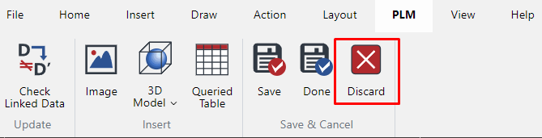
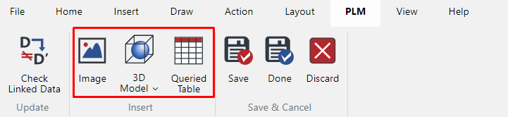
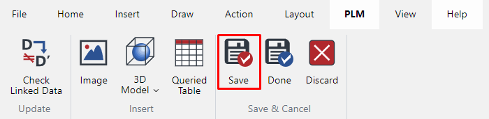
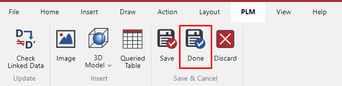
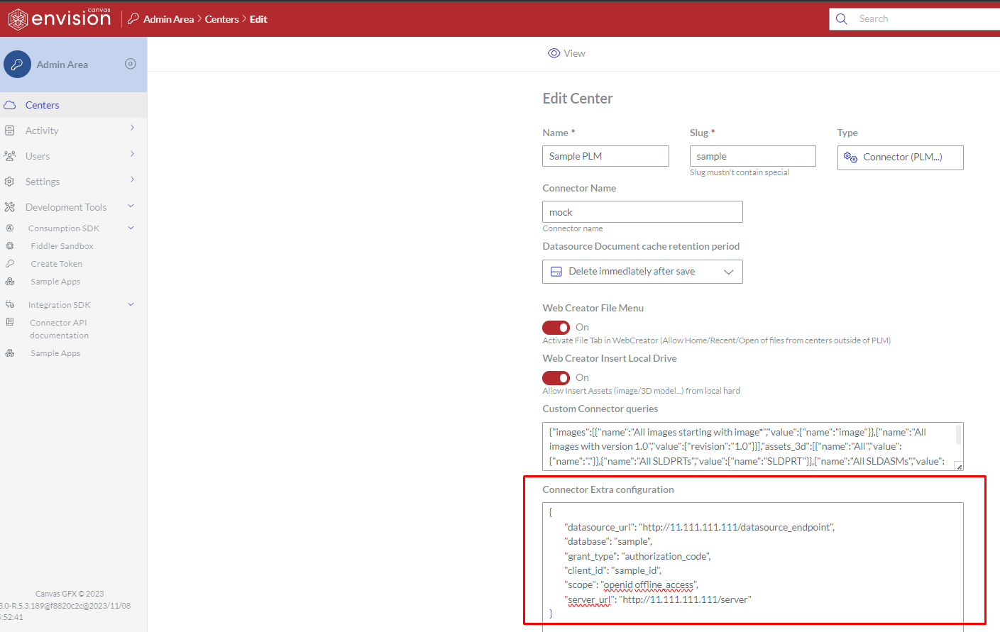
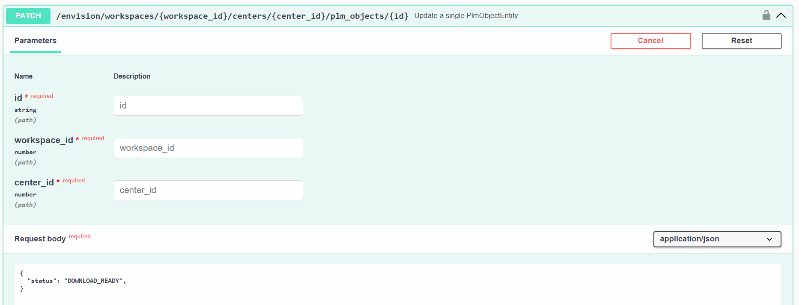
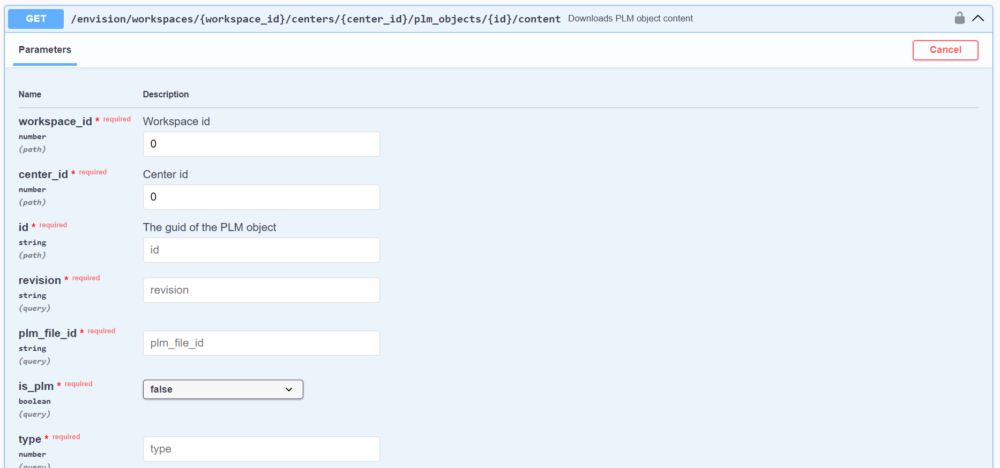

# Getting started with Envision Connector

## About 

This article describes how to write an Envision Connector, in Typescript.
Envision Connector let you connect a datasource system (like a PLM) to Envision Product. 

For example:
- You can integrate a PLM software to get all the assets (3D, images, CAD information) in Envision Creator,
- You can load an Envision document (evdoc) from the PLM software.
- You can save an Envision document back to the PLM software.

In order to create these functionalities, you'll need to create a Connector between the datasource system and Envision.

This connector needs to be written in Typescript (or Javascript), and installed on Envision server.
Then, you'll need to configure Envision to use the Connector.

## Glossary

### evdoc
This is the format of Envision document that is used to save/load document in Envision Creator.
The extension name is `.evdoc`

### Envision Connector
This is the element (written in Typescript/Javascript) that is used by Envision Creator to communicate with datasource system.
It is installed on Envision server and uses specific configuration to connect to the datasource.

### Datasource system
This is the application that will be connected to Envision Creator, and that stores all the assets/documents. It's the "single source of truth"

### Envision Creator
This is the product used to create/edit/view Envision documents

## Writing a Connector step by step

### Connector example

You'll find the connector example here: https://github.com/canvasgfx/ev-connector-sample/src/ev-connector-example.ts
This is a good starting point, as it provides the minimum basic functions to be implemented.

In order for the connector to communicate with third-party application, it needs a few functions to be implemented. These functions are described below.

#### discard function

This function is called when user hits "Discard" button in the User Interface:

This command discards the local changes in Envision WebCreator, and notifies datasource system of this action
(this will typically release the datasource document lock, on datasource side)

*Function signature*

`discard(context: EvConnectorContextDto, datasourceObj: EvConnectorObjectDefinition): Promise<void>;`

*Parameters*

`context` context of the call (user id, center id...)`

`datasourceObj` datasource document

#### list function

This function is called when user hits "Image", "3D Model" or "Queried table" button in the User Interface:

This command will list all the assets in the datasource system, based on the query

*Function signature*

`list(context: EvConnectorContextDto, query: EvConnectorQuery): Promise<Array<EvConnectorObjectDefinition>>;`

*Parameters*

`context` context of the call (user id, center id...)`

`query` connector query, @see: EvConnectorQuery

#### open function

This function is called when user opens a document from datasource system.
The datasource system will use a specific Envision Creator URL to open the document, for example:

https://envision_creator_install.com/design/?id=XXXX&center_id=2&revision=A&plm_file_id=YYYY&name=TestDocument

It notifies datasource system that the document has opened successfully in WebCreator
(it typically will lock the document in datasource system)

*Function signature*

`open(context: EvConnectorContextDto, id: string, revision: string, name: string, is_new?: boolean): Promise<void>;`

*Parameters*

`context` context of the call (user id, center id...)

`id` connector document identifier

`revision` connector document revision number

`name` connector document name. This field is important when we first create the document in Envision

`is_new` is it a new connector document? If yes, we recommend to create an empty file on datasource system to avoid any problem in
other workflows.

#### readWithMeta function

This method is used to grab the data from datasource system.

It reads datasource asset (binary) with metadata (last update date...).

The data could be an evdoc, 3D asset, image, or Queried table.

NOTE: this method is used when Envision Creator needs to load the evdoc (if user tries to open it).

*Function signature*

`readWithMeta(context: EvConnectorContextDto, datasourceObj: EvConnectorObjectDefinition): Promise<[Readable, EvConnectorObjectMetaData]>;`

*Parameters*

`context` context of the call (user id, center id...)

`datasourceObj` the datasource object info to get the file content

#### requestRead function

This command notifies datasource that the PLM document/asset will be downloaded.
When it's ready to be downloaded, PLM system needs to notify it with PlmObjectStatus.DOWNLOAD_READY

*Function signature*

`requestRead(context: EvConnectorContextDto, datasourceObj: EvConnectorObjectDefinition): Promise<boolean>;`

*Parameters*

`context` context of the call (user id, center id...)

`datasourceObj` the datasource object info to get the file content

#### save function

This command is triggered whenever the user hits "save" button in the User Interface

It can notify datasource system that the document is ready to be saved
(the document on WebCreator will be in PENDING_SAVE status until the operation is finished on datasource side)

It can also directly send the data to the datasource (depending on the datasource workflow, see section Synchronous calls below).

*Function signature*

`save(context: EvConnectorContextDto, datasourceObj: EvConnectorObjectDefinition, content?: Readable, assets?: Array<EvConnectorAsset>): Promise<boolean>;`

*Parameters*

`context` context of the call (user id, center id...)

`content` the content to save in datasource (if async call, this field is not used. See doc).

`assets` the list of assets attached to this document

`datasourceObj` the datasource object info to get the file content

#### save and Done function

This command is triggered whenever the user hits "Done" button in the User Interface

This command is similar to `save` except that it can perform extra steps on datasource side (for example, releasing a lock)

*Function signature*

`saveAndDone(context: EvConnectorContextDto, datasourceObj: EvConnectorObjectDefinition, content?: Readable, assets?: Array<EvConnectorAsset>): Promise<boolean>;`

*Parameters*

`context` context of the call (user id, center id...)

`content` the content to save in datasource (if async call, this field is not used. See doc).

`assets` the list of assets attached to this document

`datasourceObj` the datasource object info to get the file content

## Authentication with Datasource

In order for Envision Connector to communicate with datasource system, it needs a mechanism to authenticate to it.

Some extra parameters can be configured in the user interface, as shown below:

If there is any need for specific URL, info, or secret, it could be specify here.

Please note that this information is not encrypted, so every Envision Workspace administrator can see the values.

Then, in the connector code, you can access such information using `EvConnectorContextDto.connector_config`. (It will contain all the information of this field).

## Read/write workflows

Connector can support 2 different ways to get/save the data in the datasource. Asynchronous or synchronous workflow.

### Synchronous workflow

When the datasource is capable of dealing with Read/write sync calls, here are the steps to implement this workflow:

*Sync Read calls*
1. Envision Creator will notify datasource that it's starting to read data (via Connector), if needed. When `requestRead` is implemented, just returns `false` at the end of the function.
2. Envision Creator will download content from datasource right after step 1 (without waiting). It will call `readWithMeta` to get data content from datasource.

*Sync Write calls*
1. Envision Creator will upload content that it wants to save into datasource (via Connector). When `save` or `saveAndDone` is implemented, just send data content with the correct endpoint to upload into datasource.

### Asynchronous workflow

Sometimes the datasource is used asynchronously for saving/loading data. It could be the case if datasource needs extra work to prepare data to be downloaded or saved.

*Async Read calls*

The steps are:
1. Envision Creator will notify datasource that it wants to read data (via Connector). When `requestRead` is implemented, just call datasource with the correct endpoint to notify it. Method must return `true`.
2. When data is ready to be downloaded, datasource must notify Envision. It can do it with API endpoint here: [Update datasource Object status](https://github.com/canvasgfx/ev-connector-sample/blob/main/docs/GETTING_STARTED.md#update-datasource-object-status) with the status **DOWNLOAD_READY**
3. Then, `readWithMeta` will be automatically called to download data from datasource

*Async Write calls*

The steps are:
1. Envision Creator will notify datasource that it wants to save data (via Connector). When `save` or `saveAndDone` is implemented, just call datasource with the correct endpoint to notify it. Method must return `true`.
2. Datasource then will call API endpoint here: [Read Object content](https://github.com/canvasgfx/ev-connector-sample/blob/main/docs/GETTING_STARTED.md#read-object-content)
3. Then, when everything is correctly saved on datasource side, it must notify Envision that the operation is complete, using [Update datasource Object status](https://github.com/canvasgfx/ev-connector-sample/blob/main/docs/GETTING_STARTED.md#update-datasource-object-status) with the status: **SAVE** or **SAVE_DONE**. 

*Error handling in Async*

If at any time, an error occured on datasource side, it can notify Envision by calling [Update datasource Object status](https://github.com/canvasgfx/ev-connector-sample/blob/main/docs/GETTING_STARTED.md#update-datasource-object-status) with the status: **ERROR**, and the `reason` (which will be displayed to the end user)

## General error handling in Connector

If an error occurred, connector implementation should throw:

`new BadRequestException('message to display to end user');`

or

`new UnprocessableEntityException('token expired');` (in case a token needs to be renewed)

You can also log into the server logs, using:

- `context.logger.log('message')` 
- `context.logger.warn('message')`
- `context.logger.error('message')`

## Envision API endpoints

There is a few API endpoints that can be used by datasource to communicate with Envision.

### Update datasource Object status

This endpoint is used to notify that something happened on datasource side (async workflow).

### Read Object content

This endpoint is used to download an evdoc that is stored in Envision Creator.
